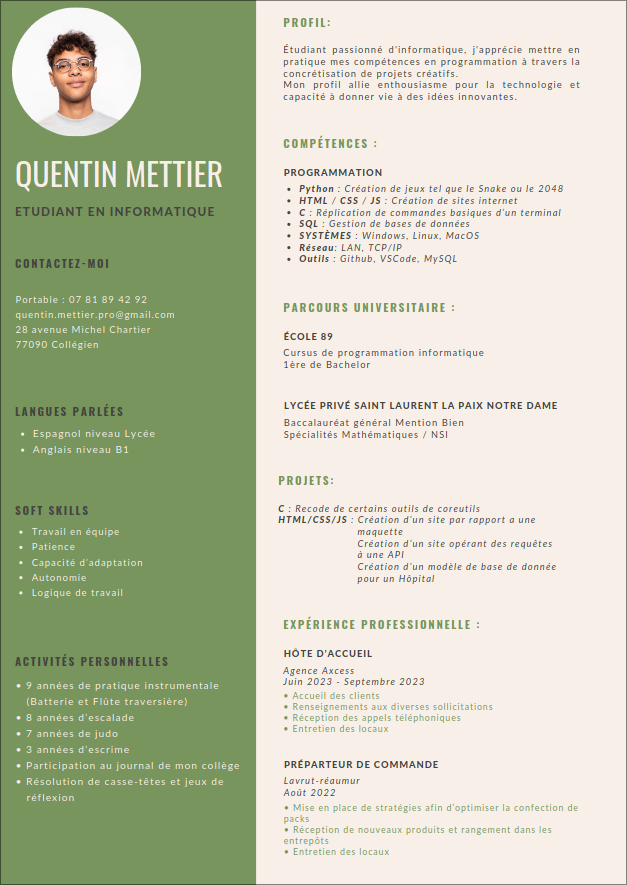

## Salut, c'est moi Quentin !

### Qui suis-je ?
Actuellement etudiant en premiere annee d'informatique, je suis un passionne de nouvelles technologies. Plutot curieux, je suis toujours motive a travailler sur de nouveaux projets.

### Et actuellement ?
Je possede de solides connaissances dans les langages suivants :
<ul>
  <li>C</li>
  <li>PHP</li>
  <li>HTML</li>
  <li>CSS</li>
  <li>Javascript</li>
  <li>SQL</li>
  <li>Arduino</li>
</ul>

### Si vous souhaitez voir mes projets...
J'ai choisi d'épingler certains projets que je considère comme réussis sur ce profil GitHub. Allez y jeter un coup d'œil !

###  Mes objectifs futurs...
Actuellement, je suis en train de développer un intérêt pour les systèmes d'exploitation, notamment Linux. Ainsi, j'apprends chaque jour à me servir de nouveaux outils. Qui sait... peut-être qu'un jour je pourrai partager avec vous mes avancées sur ce profil.

### Me contacter :

